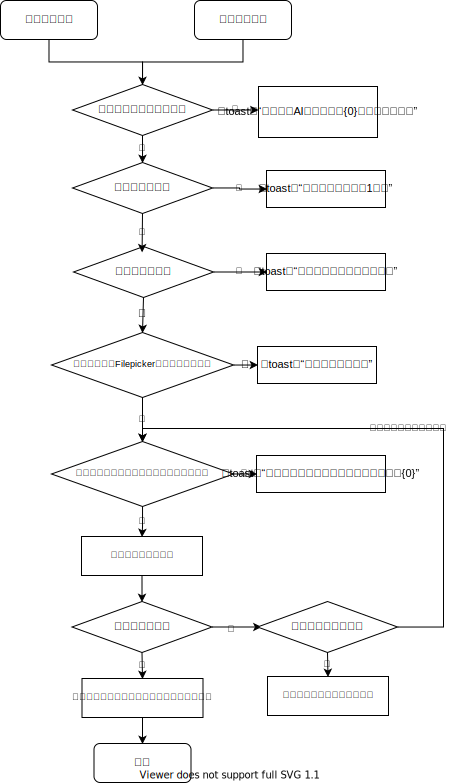

# AI配音升级与语音转换需求

## 1. 功能概述

### 1.1 功能范围

1）本次统一升级音频生成服务接口，AI朗读与语音转换共用同一套新服务。  
2）本次 AI朗读仅做服务切换，并新增部分音色。  
3）本次新增语音转换能力，允许用户通过录音或上传音频文件并转换为指定音色。  
4）语音转换生成结果允许用户试听、修改参数并重新生成、确认后保存。  
5）语音转换保存后的音频进入现有自定义音频人工审核流程。  

## 2. 基础规则

### 2.1 服务接口切换

1）本次音频生成统一升级为新服务接口，AI朗读与语音转换共用该接口。  
2）旧音色与本次新增音色均使用升级后的服务接口。  
3）新服务接入文档：  
[新版服务接入文档](https://docs.popo.netease.com/lingxi/e6c4613545e644f2b4113367ef73bdc6)  

### 2.2 AI朗读规则

1）AI朗读原有页面结构、操作流程、参数使用方式均不调整。  
2）文本长度限制继续沿用旧规则。  
3）开放条件继续沿用旧规则。  
4）每日次数限制继续沿用旧规则。  
5）保存链路继续沿用旧规则。  
6）本次新增部分可选音色，具体内容详见策划配表。  

### 2.3 语音转换规则

#### 2.3.0 功能流程

#### 2.3.1 请求与限制

1）语音转换与 AI朗读共用开放条件。  
2）语音转换与 AI朗读共用每日次数限制。  
3）用户每次发起语音转换、修改参数并重新生成时，均扣减一次次数；试听与保存不扣减次数。  
4）当开放条件不满足时，不允许发起语音转换。  
5）当每日次数不足时，不允许发起语音转换。  

#### 2.3.2 输入与请求参数

1）语音转换支持录音输入与上传音频输入两种方式。  
2）用户发起语音转换请求时，请求中至少携带以下内容：  
- 源音频  
- 目标音色  
- 音量参数  
- 用户身份信息  
- 能力类型标识  
3）当录音被取消时，本次不发起转换请求。  
4）当上传失败时，本次不发起转换请求，并提示上传失败。  
5）当上传音频不符合要求时，本次不发起转换请求，并提示对应失败原因。  

#### 2.3.3 返回与重生成规则

1）转换成功后，服务返回一份可试听的转换结果。  
2）转换结果需同时支持客户端试听原始语音与转换音频。  
3）系统需记录最近一次成功生成所使用的参数。  
4）当当前参数与最近一次成功生成参数一致时，不允许发起“修改参数并重新生成”。  
5）当用户修改音色或音量后，允许再次发起转换请求。  
6）重新生成成功后，最近一次成功生成参数更新为本次参数。  
7）当转换失败时，服务返回失败结果，客户端展示失败提示。  

#### 2.3.4 保存与审核

1）用户确认结果后，可对当前转换结果执行保存。  
2）保存成功后，音频进入《自定义文件》中的自定义音频列表。  
3）语音转换生成的音频保存后，进入现有自定义音频人工审核流程。  
4）保存后的音频默认以“审核中，完成后可试听”状态进入列表。  
5）审核中音频不可正常试听。  
6）审核通过后，音频恢复为可试听状态。  
7）当保存失败时，客户端提示保存失败，用户可再次尝试保存。  

### 2.4 配置说明

#### 2.4.1 复用配置

| key | 说明 |
| --- | --- |
| AI_AUDIO_DAILY_LIMIT_NUM | AI朗读每日次数限制，语音转换复用该限制 |

#### 2.4.2 新增配置

| key | 说明 |
| --- | --- |
| VOICE_CONVERT_AUDIO_DURATION | 语音转换支持的最短、最长音频时长 |
| VOICE_CONVERT_FILEPICKER_TIMEOUT | 语音转换上传音频超时时间 |
| VOICE_CONVERT_REQUEST_TIMEOUT | 语音转换服务请求超时时间 |

## 3. 界面交互

### 3.1 音色升级角标

#### 3.1.1 涉及界面

- AI朗读
- 语音转换

#### 3.1.2 功能说明

| 控件/区域 | 变更类型 | 说明 |
| --- | --- | --- |
| 音色标题区 | 新增 | AI朗读与语音转换的音色标题旁均新增“升级”角标 |

#### 3.1.3 交互逻辑

1）“升级”角标仅作升级标识展示，不响应点击。  

### 3.2 语音转换-待输入状态

#### 3.2.1 涉及界面

- 语音转换主界面-待输入状态

#### 3.2.2 功能说明

| 控件/区域 | 变更类型 | 说明 |
| --- | --- | --- |
| 页签区 | 新增 | 在音频生成页左侧新增“语音转换”页签 |
| 音色区 | 新增 | 新增语音转换专用音色选择区 |
| 音量区 | 新增 | 新增音量调节区 |
| 录音按钮 | 新增 | 新增“按住录音”按钮 |
| 更多按钮 | 新增 | 新增“...”入口，点击后展开上传音频 |

#### 3.2.3 交互逻辑

1）用户切换到“语音转换”页签后，默认进入待输入状态。  
2）点击并按住“按住录音”后进入录音中状态。  
3）点击“...”后弹出更多菜单。  
4）点击“上传音频”后拉起系统音频选择能力。  
5）中间列表默认展示已保存与审核中的语音转换音频。  

### 3.3 语音转换-录音中状态

#### 3.3.1 涉及界面

- 语音转换主界面-录音中状态

#### 3.3.2 功能说明

| 控件/区域 | 变更类型 | 说明 |
| --- | --- | --- |
| 主按钮 | 修改 | 按住后切换为录音中状态按钮 |
| 提示文案 | 新增 | 主按钮上方显示“上滑可取消” |
| 取消态表现 | 新增 | 上滑后按钮切换为取消态 |
| 按钮动效 | 新增 | 录音中与取消态均展示状态动效 |

#### 3.3.3 交互逻辑

1）用户按住录音按钮后，页面进入录音中状态。  
2）录音中状态下，主按钮显示“松手后开始转换”。  
3）主按钮上方显示“上滑可取消”。  
4）用户上滑至取消区域后，主按钮切换为“松手取消”。  
5）用户下滑回安全区域后，主按钮恢复为“松手后开始转换”。  
6）用户在安全区域松手后，进入生成中状态。  
7）用户在取消区域松手后，返回待输入状态。  

### 3.4 语音转换-生成中状态

#### 3.4.1 涉及界面

- 语音转换主界面-生成中状态

#### 3.4.2 功能说明

| 控件/区域 | 变更类型 | 说明 |
| --- | --- | --- |
| 处理中反馈 | 新增 | 新增生成中反馈表现 |
| 输入入口 | 修改 | 生成中期间录音与上传入口均不可操作 |

#### 3.4.3 交互逻辑

1）用户完成录音或上传音频后，页面进入生成中状态。  
2）生成中状态下展示处理中反馈。  
3）生成成功后进入生成后确认状态。  
4）生成失败后停留在当前页签，并提示失败原因。  

### 3.5 语音转换-生成后确认状态

#### 3.5.1 涉及界面

- 语音转换主界面-生成后确认状态

#### 3.5.2 功能说明

| 控件/区域 | 变更类型 | 说明 |
| --- | --- | --- |
| 试听结果区 | 新增 | 新增“原始语音”“转换音频”双试听卡 |
| 参数区 | 修改 | 该状态下仅保留音色、音量参数 |
| 重新生成按钮 | 新增 | 新增“修改音色并重新生成” |
| 底部操作区 | 新增 | 新增“重新录入”“满意并保存”按钮 |

#### 3.5.3 交互逻辑

1）进入该状态后，页面展示原始语音、转换音频、音色、音量。  
2）原始语音与转换音频均支持点击试听，再次点击停止。  
3）当当前参数与上次生成参数完全一致时，“修改音色并重新生成”按钮置灰；任一参数变化后按钮激活。  
4）点击“修改音色并重新生成”后，页面重新进入生成中状态。  
5）点击“重新录入”后，放弃当前结果并回到待输入状态。  
6）点击“满意并保存”后，执行保存，完成后回到待输入状态。  

### 3.6 已保存音频列表

#### 3.6.1 涉及界面

- 音频生成页中间结果列表

#### 3.6.2 功能说明

| 控件/区域 | 变更类型 | 说明 |
| --- | --- | --- |
| 结果列表 | 修改 | 语音转换复用 AI朗读现有列表结构 |
| 审核中副文案 | 新增 | 审核中条目显示“审核中，完成后可试听” |
| 播放按钮 | 修改 | 审核中条目播放按钮置灰 |
| 更多按钮 | 删除 | 审核中条目不显示更多按钮 |

#### 3.6.3 交互逻辑

1）当分别位于“AI朗读”“语音转换”两个不同页签下时，只显示对应能力生成的音频。  
2）语音转换音频处于审核中时，列表项显示“审核中，完成后可试听”。  
3）审核中时播放按钮不可点击，“更多”按钮不显示。  

### 3.7 更多菜单与上传音频

#### 3.7.1 涉及界面

- 语音转换主界面-更多菜单

#### 3.7.2 功能说明

| 控件/区域 | 变更类型 | 说明 |
| --- | --- | --- |
| 更多菜单 | 新增 | 点击“...”后展开更多菜单 |
| 上传音频入口 | 新增 | 菜单内新增“上传音频”操作项 |

#### 3.7.3 交互逻辑

1）点击“...”后弹出更多菜单。  
2）点击“上传音频”后拉起系统音频选择能力。  
3）选择成功后直接进入生成中状态。  
4）取消选择后页面保持在待输入状态。  

## 4. USLOG

1）行为日志：  
- 每次成功保存语音转换音频后，记录一次行为日志。  
- 每次成功保存AI朗读音频后，记录一次行为日志。  

2）结果日志：  
- 地图发布时，若包含AI朗读音频，则记录结果日志。  
- 地图发布时，若包含语音转换音频，则记录结果日志。  
